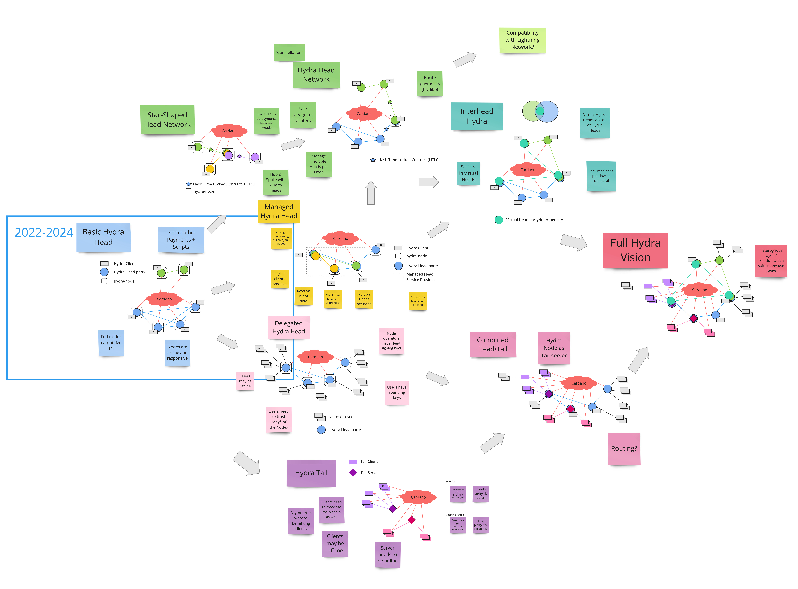

## Agenda
- Trym: Temperature check on Hydra 2025
- Sebastian: Roadmap updates
  - Deposit-based increment pivot (naming?)
  - New ideas from hydra-doom 
  - API consistency: [cardanonical](https://github.com/CardanoSolutions/cardanonical/) / [CIP-116](https://github.com/cardano-foundation/CIPs/blob/master/CIP-0116/README.md)

## Attendees
  - [x] Sebastian Nagel
  - [x] George Flerovsky
  - [ ] Reza Baram
  - [ ] Sasha Bogicevic
  - [x] Tudor Cotruta
  - [ ] Philip Di Sarro
  - [x] Pi Lanningham
  - [ ] Arnaud Bailly
  - [ ] Sorin Canter
  - [x] Ilia Rodionov
  - [ ] Michael Yagi
  - [ ] Sam Delaney
  - [ ] Colin Hobbins
  - [ ] Benjamin Hart
  - [x] Franco Testagrossa
  - [x] Noon van der Silk
  - [x] Trym Bruset
  - [ ] Caiña Costa

## Notes

- Chatting about micro payments projects

- New lu.ma calendar: https://lu.ma/cardano-scaling

- Roadmap up-date by Sebastian
  - Incremental decommit via deposit
  - Confirmed naming
  - Mentioned how this is relevant for Gummiworm

- Hydra doom
  - Multiplayer possible?
  - Follow-up event at the summit

- How does this relate to other plans for EOY and 2025?
  - Prioritising maturing the Basic Hydra Head protocol
  - Trym walks throught the constellation diagram:
  
    
  
  - Tail is quite similar to other projects like optimistic/zk rollups
  - Network of heads in the spirit of ligthning (goal: interhead hydra) most promising path?
  
  - Pi:
    - Short term things from hydra-doom
      - (Event) log rotation
      - Sam: Could use cardano tracing libraries (Pi was meaning the event log, its state)
    - Mid-term: More flexibility on ledger rules
    
  - Pi: Joint scope could be on standardization
    - on wallet interaction
    - on datum interfaces

  - Should not redo things too much in between variants of protocols
  - In fact, Hydra Head and Hydrozoa have been converging (e.g. as we design incremental commits now)
  - Having these fast moving R&D projects is very helpful to scope out more heavy-weight work streams

  - More input on the various constellation "paths"
    - Where would we step on less toes (of other community projects)?
    - Where would we be able to find more common scope/project?
  
  - Discussion about interhead hydra
    - We decided to follow-up this in a [Github discussion](https://github.com/cardano-scaling/hydra/discussions)
 
- Sebastian: raising awareness on standardization of API types
  - Related to issues discovered recently: https://github.com/cardano-scaling/hydra/issues/1543
  - Pi: leans towards using anything Ogmios/Kupo is using (dolos, cardano-rpc seem consistent, although in binary)
  - George: not going to innovate
  - Decision: working group is advocating the adoption of [cardanonical](https://github.com/CardanoSolutions/cardanonical/)
    - Followed-up in: https://github.com/cardano-scaling/hydra/issues/1577
  
- Trym: how to prioritize features?
  - Unrecoverability vs. enabling use cases
    - Maybe no decision needed as incremental commits are a must-have for some use cases
  - Consistency and standardization maybe a bit less important
